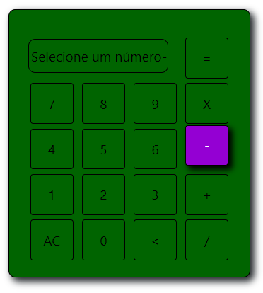
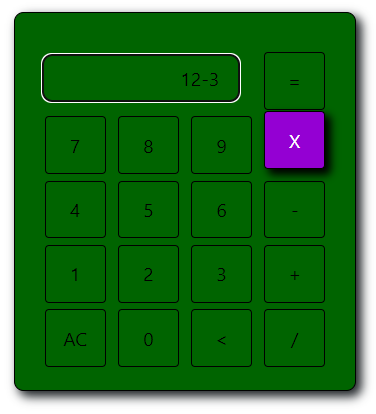

<h1>Calculadora 🧮</h1>

<h2>Sobre:</h2>

Nesse projeto meu objetivo era por em prática um pouco que sei de JavaScript e jQuery, testando minha lógica de programção. Gostei muito de desenvolver e principalmente do resultado alcançado rs. Deixei alguns console log para que possam acompanhar um pouco do que acontece quando selecionamos alguns botões. 🧮

<h2>Imagens</h2>

<h2>Calculadora</h2>

<h2>Caso tenha sido selecionada uma operação sem antes ter selecionado um número:</h2>

<h2>Resultado no Visor:</h2>

OBS: O Visor não pode ser editado por teclado, apenas selecionando os butões na tela.

